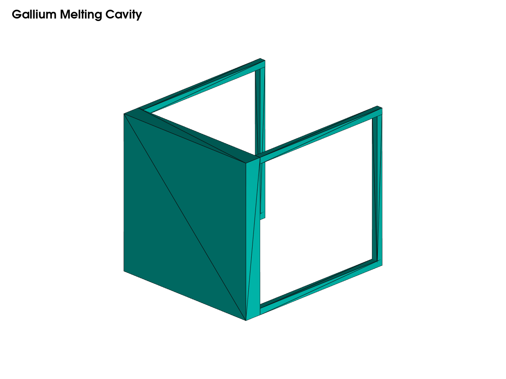
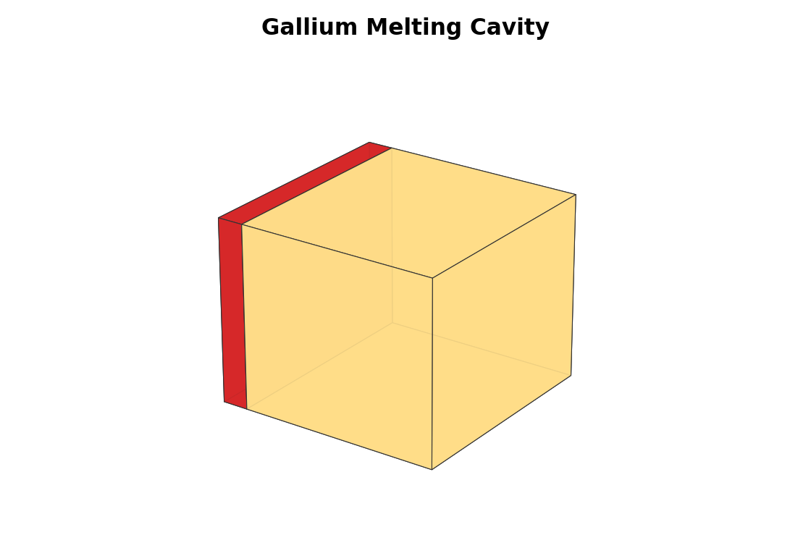

# Case Report — Gallium Melting Cavity

## Objective

PCM melting benchmark with liquid-fraction tracking.

## Geometry

Geometry source: [`geometry/model.stl`](../geometry/model.stl).

## Current Result State

No numerical result is available yet. The case is included as a roadmap item
because it has a clear literature/benchmark basis and a defined OpenFOAM
implementation path.

## Next Steps

1. Build geometry and mesh generator.
2. Add OpenFOAM dictionaries.
3. Run smoke test.
4. Add validation plots and limitations.
